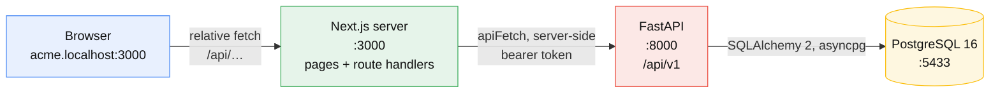
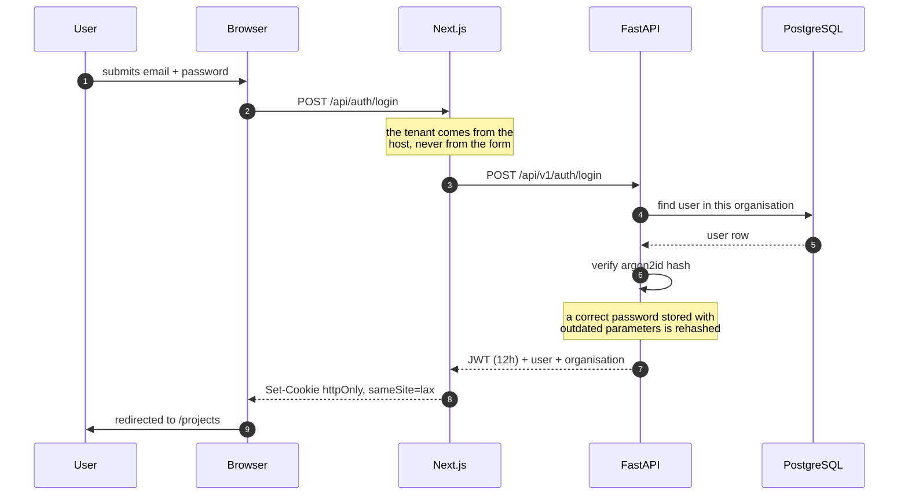
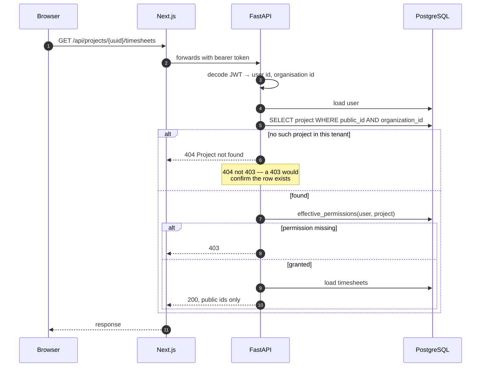
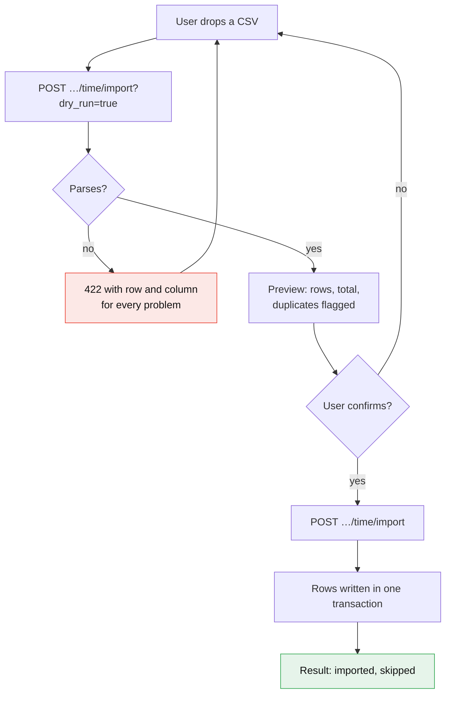

# Architecture

## The pieces



**The browser never calls FastAPI.** Every client-side `fetch` uses a relative
path to a Next.js route handler, which forwards to the API from the server with
the session attached. Both `lib/session.ts` and `lib/api.ts` are server-only —
they import `next/headers` and `next/server` respectively.

Two consequences worth knowing:

- The API bearer token lives in an **httpOnly cookie**. Client JavaScript cannot
  read it, and the token never reaches the browser as a value.
- What a user can observe in DevTools is the `/api/*` layer, not `/api/v1/*`.
  FastAPI is still reachable directly on `:8000` in development — "not visible"
  is not "not reachable".

## Layout

```
frontend/            Next.js 16, App Router, TypeScript, Tailwind 4
  src/app/           routes — pages and route handlers
  src/components/    UI, grouped by area
  src/lib/           data access, formatting, session
backend/             FastAPI, Python 3.12
  app/api/routes/    endpoints, one module per resource
  app/models/        SQLAlchemy models
  app/schemas/       Pydantic request and response models
  app/services/      business logic: rbac, timesheets, time_import
  alembic/versions/  migrations
  scripts/           seeds
  tests/             pytest
docs/                this documentation
```

## Signing in



The JWT carries `sub` (user id), `org` (organisation id), `slug` and an
expiry — 12 hours by default (`access_token_expire_minutes`). It is signed
HS256 and validated on every request.

## A request that needs a permission



`require_project_permission` is the single place a project's public id is
exchanged for its row — one lookup on a unique index, no join. Everything after
it works from the `BIGINT` key.

## Bulk time upload

The one flow with real branching. Nothing is written until the whole file has
been read and shown back.



Rules the parser enforces, in `app/services/time_import.py`:

- **At most 31 rows of time**, the header not counted — one upload is one month.
- **A single bad row rejects the whole file.** A half-applied month is harder to
  reconcile than one that never landed.
- Dates read **day-first** (`05/10/2026`), ISO also accepted.
- Duration as `logged_hours` (`1:40` or `1.5`), `logged_minutes` (under 60), or
  both added together.
- Re-uploading the same file skips rows already logged, unless forced.

## Multi-tenancy

`Organization` is the root. Every other table reaches it, directly or through a
parent, and deleting one cascades.

Three things keep tenants apart:

1. **The subdomain decides the tenant**, and it is read from the host header —
   never from user input.
2. **The JWT names the organisation it was issued for**, so a token from one
   tenant is meaningless in another.
3. **Every query is scoped to the caller's organisation**, including lookups by
   public id, which are unguessable already. Isolation does not rest on an id
   being hard to guess.
