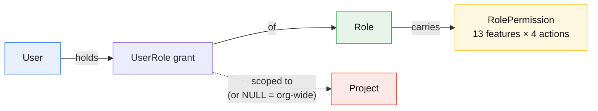
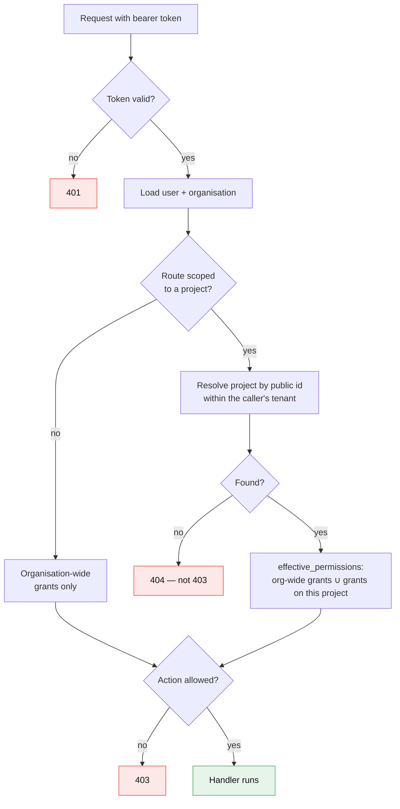

# Authentication and authorization

Two separate questions. *Who are you* is authentication; *what may you do here*
is authorization. They are answered in different places.

## Authentication

- Passwords are hashed with **argon2id** (`pwdlib[argon2]`). A correct password
  stored with outdated parameters is transparently rehashed on sign-in, so
  raising the cost later upgrades accounts as people return.
- Sign-in returns a **JWT**, HS256, valid **12 hours**
  (`access_token_expire_minutes`, default `60 * 12`).
- The token carries the organisation it was issued for, so a token from one
  tenant is meaningless in another.
- The browser holds it in an **httpOnly cookie**. Client JavaScript cannot read
  it; the Next.js server attaches it when forwarding to the API.
- **There is no sign-up.** Accounts are created by an administrator, or by
  `npm run org:create`.

The tenant comes from the **subdomain**, never from the login form. Credentials
are only checked inside that organisation, so the same address can exist in
several tenants without collision.

## The model



A user can hold **several roles at once** — Project Manager on one project,
Member on another — and their effective permissions are the union.

## Features and actions

Thirteen features, each with four actions (`view`, `create`, `edit`, `delete`):

`projects` · `tasks` · `timesheet` · `time_entry` · `gantt` · `calendar` ·
`discussions` · `files` · `reports` · `members` · `roles` · `billing` ·
`settings`

`timesheet` and `time_entry` are deliberately separate. Setting up the month is
a manager's job; filling it in is everyone's.

**View is implied by everything else** — enforced in the database:

```sql
CHECK (can_view OR NOT (can_create OR can_edit OR can_delete))
```

You cannot hold create, edit or delete without view.

## The six built-in roles

Seeded per organisation and marked `is_system`: their permissions are editable,
but they cannot be deleted or renamed.

| Role | Scope | In short |
| --- | --- | --- |
| Organization Admin | organization | Everything, everywhere |
| Project Manager | project | Runs a project end to end |
| Team Lead | project | Assigns work, reviews progress |
| Member | project | Does the work, logs their time |
| Client | project | Sees shared information, comments |
| Viewer | project | Read-only |

### The default matrix

`V` view · `C` create · `E` edit · `D` delete · `—` none

| Feature | Org Admin | Project Manager | Team Lead | Member | Client | Viewer |
| --- | --- | --- | --- | --- | --- | --- |
| projects | VCED | VCE | V | V | V | V |
| tasks | VCED | VCED | VCE | VE | V | V |
| timesheet | VCED | VCED | V | V | — | — |
| time_entry | VCED | VCED | VCE | VCE | — | — |
| gantt | VCED | VCE | VE | V | V | V |
| calendar | VCED | VCE | V | V | V | V |
| discussions | VCED | VCED | VC | VC | VC | V |
| files | VCED | VCED | VC | VC | V | V |
| reports | VCED | V | V | — | — | — |
| members | VCED | VCE | V | V | — | — |
| roles | VCED | — | — | — | — | — |
| billing | VCED | — | — | — | — | — |
| settings | VCED | — | — | — | — | — |

Read the time rows together — they are the design in miniature:

- **Project Manager** has `timesheet: VCED` and `time_entry: VCED`. Delete on
  time entries is what allows correcting and removing the team's entries, and
  delete on timesheets is what reveals private ones when auditing.
- **Team Lead and Member** have `timesheet: V` but `time_entry: VCE`. They fill
  timesheets in and correct their own entries; they cannot create, rename or
  archive a timesheet.
- **Client and Viewer** have neither. Time is internal.

## How a check runs



`effective_permissions` unions organisation-wide grants with grants on the
project in question. Organisation-wide always applies; project-scoped applies
only inside its project.

Two dependencies do this work:

- `require_permission(feature, action)` — organisation-wide routes.
- `require_project_permission(feature, action)` — project routes. It also
  resolves the project and returns it, so handlers do not fetch it twice.

## Rules beyond the matrix

Some things are refused even when the permission is held.

**A workspace can never lose its last administrator.** Four operations check
`has_role_manager` before proceeding:

| Operation | Excludes from the count |
| --- | --- |
| Remove a role grant | that grant |
| Deactivate or delete a person | that person |
| Delete a role | that role |

Each refuses with 400 and says what to do instead. Without this, a single click
could produce a workspace nobody can administer — unrecoverable from inside the
product.

**You cannot remove your own account.** Refused with 400, pointing at another
administrator.

**Built-in roles cannot be deleted or renamed.** Their permissions remain
editable.

**Private timesheets** are visible only to their assignees and to anyone
holding `timesheet.delete`. Others get a 404.

**Other people's time entries** need `time_entry.delete` to edit or remove.
Holding only `edit` lets you correct your own.

## Where it is enforced

| Layer | Does what | Trust |
| --- | --- | --- |
| Database | CHECK and UNIQUE constraints | Last line, always holds |
| API dependencies | Permission checks per request | **The real boundary** |
| Next.js pages | Hides what you cannot do | Convenience only |

The interface hides actions that would fail — that is what
`/projects/{id}/permissions` is for — but hiding a button is not a security
control. Every route re-checks.
